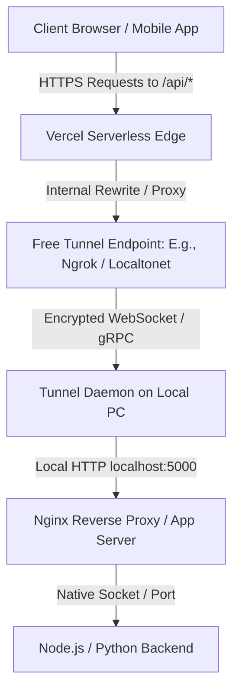

# Self-Hosting Without a Domain: Standalone Vercel Rewrite & Tunneling Guide

This guide provides a comprehensive, step-by-step plan to convert a low-spec PC (e.g., Intel Pentium, 4GB RAM) into a reliable, self-hosted backend server and connect it to your Vercel-deployed frontend **without purchasing or configuring a custom domain**.

By routing all API requests through the Vercel domain using **Vercel Rewrites**, you bypass CORS issues entirely, secure your backend traffic under Vercel's SSL, and can expose your local server using a free, persistent tunnel.

---

## Table of Contents
1. [System Design & Architecture](#1-system-design--architecture)
2. [Server Setup on the Old PC (Bare Metal to OS)](#2-server-setup-on-the-old-pc-bare-metal-to-os)
3. [Performance Tuning for Low RAM (4GB)](#3-performance-tuning-for-low-ram-4gb)
4. [Setting Up a Free, Persistent Tunnel (No Custom Domain Required)](#4-setting-up-a-free-persistent-tunnel-no-custom-domain-required)
5. [Backend Deployment & Process Management](#5-backend-deployment--process-management)
6. [Database Setup & Tuning (SQLite / PostgreSQL)](#6-database-setup--tuning-sqlite--postgresql)
7. [Configuring Vercel Rewrites (`vercel.json`)](#7-configuring-vercel-rewrites-verceljson)
8. [Backend CORS & Proxy Configurations](#8-backend-cors--proxy-configurations)
9. [System Hardening & Rate Limiting](#9-system-hardening--rate-limiting)
10. [Monitoring & Maintenance](#10-monitoring--maintenance)

---

## 1. System Design & Architecture

In this setup, your frontend and backend appear to the client's browser as if they are hosted on the exact same domain (e.g., `https://your-app.vercel.app`).



### Request Flow
1. **API Requests**: The client browser sends a request to Vercel (e.g., `https://your-app.vercel.app/api/users`).
2. **Rewrite / Proxy**: Vercel reads your `vercel.json` rewrites and silently forwards the request to your tunnel (e.g., `https://app-backend-123.ngrok-free.app/users`).
3. **Tunneling**: The tunnel service securely routes the request to the daemon client running on your local machine.
4. **Proxy to Application**: The tunnel agent forwards the request to local Nginx (`localhost:80`), which proxies it to your backend (`localhost:5000`).

---

## 2. Server Setup on the Old PC (Bare Metal to OS)

An old PC with a Pentium processor and 4GB RAM will struggle if loaded with a graphical user interface (GUI). We must install a lightweight, headless operating system.

### Recommended OS: Debian Server (12 "Bookworm")
* **Debian 12 Headless** is the most stable and lightweight choice. Idle RAM consumption is under **150MB**, leaving the remaining RAM for your database and application.
* **Avoid**: Desktop editions of Ubuntu or Linux Mint.

### OS Installation Steps
1. **Download Netinstaller**: Download the [Debian Network Installer ISO](https://www.debian.org/distrib/netinst).
2. **Flash to USB**: Use [Rufus](https://rufus.ie/) (Windows) or [BalenaEtcher](https://etcher.balena.io/) (Mac/Linux) to flash the ISO to a USB.
3. **BIOS Configuration**:
   - Insert the USB and turn on the PC. Boot into the BIOS (usually by pressing `F2`, `F12`, or `Del`).
   - **Power Restored Settings**: Search for "Restore on AC Power Loss" (under Power Management) and set it to **Power On**. If the power drops and comes back, the PC will automatically turn back on.
   - **Disable Laptop Lid Suspend (If using an old laptop)**:
     If your PC is an old laptop, prevent it from sleeping when you close the lid. In Debian/Ubuntu, edit `logind.conf`:
     ```bash
     sudo nano /etc/systemd/logind.conf
     ```
     Uncomment and edit the lines:
     ```ini
     HandleLidSwitch=ignore
     HandleLidSwitchExternalPower=ignore
     ```
     Restart the service:
     ```bash
     sudo systemctl restart systemd-logind
     ```
4. **Software Selection during Install**:
   - During OS installation, you will reach the **Software selection** prompt.
   - **CRITICAL**: Uncheck everything (such as GNOME, XFCE, Debian desktop environment) except **SSH Server** and **standard system utilities**.

---

## 3. Performance Tuning for Low RAM (4GB)

### 1. Create a 4GB Swap File
Swap space acts as emergency virtual memory when physical RAM is fully utilized. 
```bash
# Check for existing swap
sudo swapon --show

# Create a 4GB file
sudo fallocate -l 4G /swapfile

# Lock file permissions
sudo chmod 600 /swapfile

# Setup swap area
sudo mkswap /swapfile

# Enable swap
sudo swapon /swapfile

# Make swap persistent on system reboot
echo '/swapfile none swap sw 0 0' | sudo tee -a /etc/fstab
```

Configure the system to swap memory only when necessary (set swappiness to `15` instead of default `60`):
```bash
sudo sysctl vm.swappiness=15
echo 'vm.swappiness=15' | sudo tee -a /etc/sysctl.conf
```

### 2. Install Core Software Stack
Update system packages and install prerequisites:
```bash
sudo apt update && sudo apt upgrade -y
sudo apt install -y curl git build-essential ufw fail2ban nginx
```

##### Install Node.js LTS:
```bash
curl -fsSL https://deb.nodesource.com/setup_20.x | sudo -E bash -
sudo apt install -y nodejs
```

---

## 4. Setting Up a Free, Persistent Tunnel (No Custom Domain Required)

Since we do not have a custom domain (like `yourdomain.com`), we will use tunnel providers that offer **free static endpoints**.

### Ngrok (Free Persistent Domain)
Ngrok offers one free static domain (e.g., `your-unique-name.ngrok-free.app`) per free account.

1. **Sign Up**: Create a free account at [ngrok.com](https://ngrok.com/).
2. **Claim Free Domain**: In your Ngrok Dashboard, go to **Cloud Edge** -> **Domains** and claim your free static domain (e.g., `app-backend-123.ngrok-free.app`).
3. **Install Ngrok on Local Server**:
   ```bash
   # Add Ngrok GPG key and repository
   curl -s https://ngrok-agent.s3.amazonaws.com/files.gpg | sudo gpg --dearmor -o /etc/apt/keyrings/ngrok.gpg
   echo "deb [signed-by=/etc/apt/keyrings/ngrok.gpg] https://ngrok-agent.s3.amazonaws.com buster main" | sudo tee /etc/apt/sources.list.d/ngrok.list
   sudo apt update && sudo apt install ngrok
   ```
4. **Authenticate Ngrok**: Copy your Authtoken from the Ngrok dashboard and run:
   ```bash
   ngrok config add-authtoken YOUR_NGROK_AUTHTOKEN
   ```
5. **Start and Run Ngrok as a System Service**:
   Configure Ngrok to run continuously in the background on startup:
   ```bash
   sudo nano /etc/ngrok.yml
   ```
   Add the configuration:
   ```yaml
   version: "2"
   authtoken: YOUR_NGROK_AUTHTOKEN
   tunnels:
     backend-tunnel:
       proto: http
       addr: 80 # Forward to Nginx port 80
       domain: app-backend-123.ngrok-free.app # Use your claimed free domain
   ```
   Install and start the service:
   ```bash
   sudo ngrok service install --config /etc/ngrok.yml
   sudo systemctl start ngrok
   sudo systemctl enable ngrok
   ```

---

## 5. Backend Deployment & Process Management

Never run your backend directly in an SSH terminal. Use a process manager to monitor your apps and auto-restart them on crashes.

### Step 1: Manage Backend using PM2 (Node.js)
```bash
sudo npm install -g pm2
cd /var/www/my-backend

# Start the application
pm2 start index.js --name "my-backend-api"

# Configure PM2 to boot on startup
pm2 save
pm2 startup
```
*(Run the command outputted by `pm2 startup` to finish setting up the startup service.)*

### Step 2: Nginx Reverse Proxy Setup
Nginx routes traffic from incoming port `80` (where your tunnel drops traffic) to your internal backend port (e.g. `5000` for Node, `8000` for Python).

Create an Nginx configuration file:
```bash
sudo nano /etc/nginx/sites-available/backend.conf
```

Add configuration:
```nginx
server {
    listen 80;
    server_name localhost;

    # Gzip Compression to optimize network speed
    gzip on;
    gzip_types text/plain text/css application/json application/javascript;

    location / {
        proxy_pass http://127.0.0.1:5000; # Forward requests to backend API
        proxy_http_version 1.1;
        proxy_set_header Upgrade $http_upgrade;
        proxy_set_header Connection 'upgrade';
        proxy_set_header Host $host;
        proxy_set_header X-Real-IP $remote_addr;
        proxy_set_header X-Forwarded-For $proxy_add_x_forwarded_for;
        proxy_set_header X-Forwarded-Proto $scheme;
    }
}
```

Enable the configuration and restart Nginx:
```bash
sudo ln -s /etc/nginx/sites-available/backend.conf /etc/nginx/sites-enabled/
sudo rm /etc/nginx/sites-enabled/default # Remove default Nginx splash site
sudo nginx -t && sudo systemctl restart nginx
```

---

## 6. Database Setup & Tuning (SQLite / PostgreSQL)

Relational databases require memory. Here is how to configure them for a 4GB RAM Pentium PC.

### Option A: SQLite (Recommended for ultra-low resource usage)
SQLite stores the database in a single local file and consumes virtually **0MB** of background RAM.
Add these queries during your database initialization code:
```sql
PRAGMA journal_mode = WAL;       -- Enables concurrent read/write operations
PRAGMA synchronous = NORMAL;     -- Speeds up writes safely
PRAGMA cache_size = -64000;      -- Limits cache memory to ~64MB
```

### Option B: PostgreSQL
If you require PostgreSQL, limit connection overhead and buffer allocation:
```bash
sudo nano /etc/postgresql/*/main/postgresql.conf
```
Edit the config variables to fit a 4GB RAM environment:
```ini
max_connections = 30           # Each connection consumes ~10MB RAM. Lower connections saves memory.
shared_buffers = 512MB          # Cache pool (Set to 12.5% of total memory)
effective_cache_size = 1536MB
work_mem = 8MB
maintenance_work_mem = 128MB
```
Save and restart:
```bash
sudo systemctl restart postgresql
```

---

## 7. Configuring Vercel Rewrites (`vercel.json`)

To hide the tunnel backend and call it natively through the frontend, create a `vercel.json` file in the **root directory of your Vercel frontend repository**.

```json
{
  "rewrites": [
    {
      "source": "/api/:path*",
      "destination": "https://app-backend-123.ngrok-free.app/:path*"
    }
  ]
}
```
*Make sure to change the destination to match your actual Ngrok static tunnel domain.*

Now, in your frontend code, you can fetch data from relative paths:
```javascript
// On the client browser, this calls Vercel which rewrites the request to your local PC.
fetch('/api/users')
  .then(res => res.json())
  .then(data => console.log(data));
```

---

## 8. Backend CORS & Proxy Configurations

### CORS Configuration
Because the browser makes calls to `https://your-app.vercel.app/api/...`, the origin matches your Vercel frontend, and cross-origin requests are not triggered. However, you should secure the endpoints to only allow requests originating from your Vercel URL.

Example Express configuration:
```javascript
const express = require('express');
const cors = require('cors');
const app = express();

app.use(cors({
  origin: 'https://your-app.vercel.app', // Restrict to your Vercel Domain
  credentials: true
}));
```

### Reading Real User IPs
Because requests flow through Vercel and then Ngrok, standard logs will see the proxy server's IP. Read `x-forwarded-for` to get the client browser's true IP:
```javascript
app.get('/api/get-ip', (req, res) => {
  const userIp = req.headers['x-forwarded-for'] || req.socket.remoteAddress;
  res.json({ ip: userIp });
});
```

---

## 9. System Hardening & Rate Limiting

### 1. Protect Tunnel with a Proxy Secret (Crucial)
To prevent bad actors from finding your public Ngrok address and hitting your local server directly (bypassing Vercel's edge protection), verify a secret token that only Vercel knows.

#### In `vercel.json`:
```json
{
  "rewrites": [
    {
      "source": "/api/:path*",
      "destination": "https://app-backend-123.ngrok-free.app/:path*"
    }
  ],
  "headers": [
    {
      "source": "/api/:path*",
      "headers": [
        {
          "key": "x-proxy-header-secret",
          "value": "SUPER_SECRET_COMPLEX_TOKEN_12345"
        }
      ]
    }
  ]
}
```

#### In Backend Middleware:
```javascript
const SECRET = "SUPER_SECRET_COMPLEX_TOKEN_12345";

app.use((req, res, next) => {
  if (req.headers['x-proxy-header-secret'] !== SECRET) {
    return res.status(403).json({ error: "Access Denied: Direct requests are forbidden." });
  }
  next();
});
```

### 2. Configure Firewall (UFW)
Open SSH (port 22) and HTTP/HTTPS traffic on your server.
```bash
sudo ufw default deny incoming
sudo ufw default allow outgoing
sudo ufw allow 22/tcp
sudo ufw allow 80/tcp
sudo ufw allow 443/tcp
sudo ufw enable
```

### 3. Fail2ban Setup
Protect SSH from password brute-force bots:
```bash
sudo nano /etc/fail2ban/jail.local
```
Add configuration:
```ini
[sshd]
enabled = true
port = 22
maxretry = 3
bantime = 1d
findtime = 10m
```
Restart: `sudo systemctl restart fail2ban`.

---

## 10. Monitoring & Maintenance

Keep logs from bloating your storage, monitor RAM footprint, and recover from crashes.

### Prevent Logs from Filling the Disk
Add log rotation for PM2 logs:
```bash
# Install PM2 logrotate module
pm2 install pm2-logrotate

# Configure rotation settings
pm2 set pm2-logrotate:max_size 10M
pm2 set pm2-logrotate:retain 7
```

### Hardware Resource Checks
Check RAM and disk usage regularly via terminal tools:
* Check CPU and active thread processes: `htop`
* Check memory buffer and active swap file status: `free -m`
* Check remaining storage drive space: `df -h`
