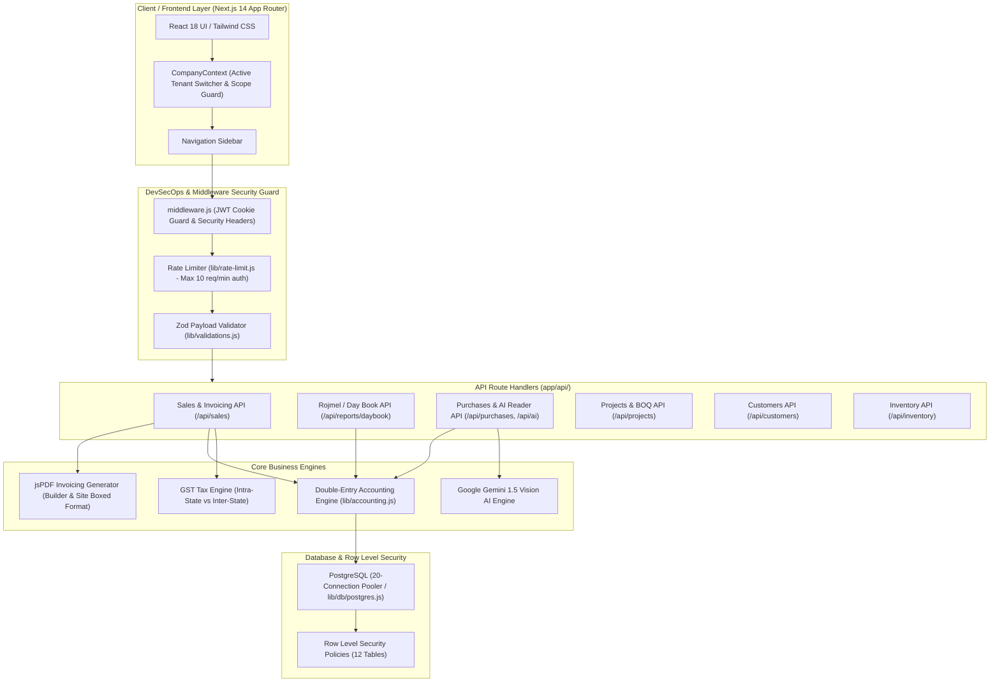
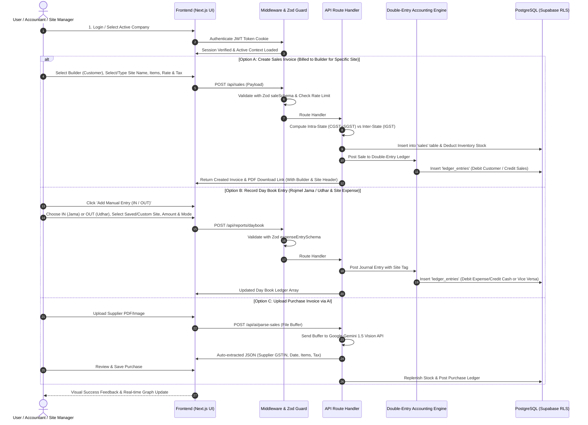
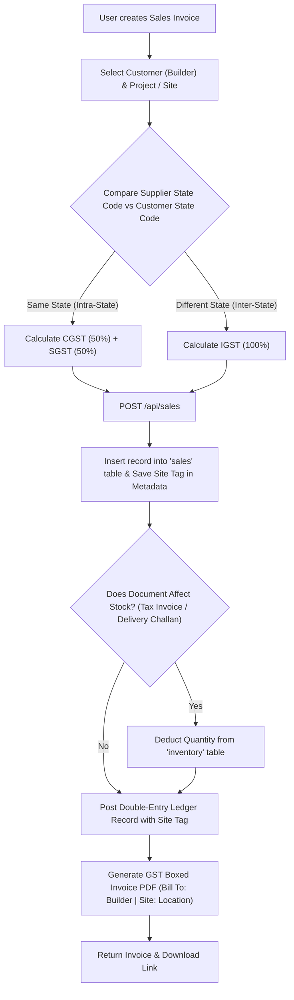
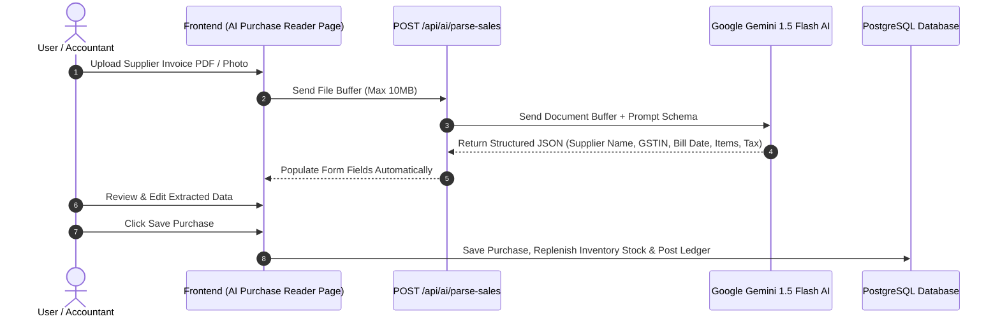
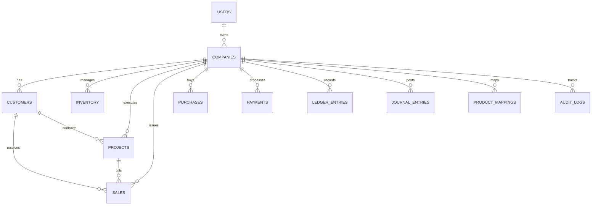

# 📘 BillBharat — Complete System Architecture & End-to-End Workflow Documentation

This consolidated document provides the complete technical architecture, operational workflows, sequence diagrams, feature capability flowcharts, database ERD, and feature specifications for **BillBharat** — a modern DevSecOps-compliant GST Invoicing, Multi-Site Inventory, BOQ Project Management, and Double-Entry Accounting (Rojmel / રોજમેળ) system built for Indian businesses.

---

## 1. High-Level System Architecture Diagram

---

## 2. End-to-End User & Data Workflow

---

## 3. Complete Feature Capabilities Flowchart (What Every Feature Does)

```mermaid
flowchart TD
    AppHome["BillBharat Application Capabilities"]

    AppHome --> F1["🏢 Companies Module (/companies)"]
    AppHome --> F2["👥 Customers Master (/customers)"]
    AppHome --> F3["📦 Inventory & Stock (/inventory)"]
    AppHome --> F4["🧾 GST Sales & Invoices (/sales)"]
    AppHome --> F5["🛒 Purchases & Bills (/purchase)"]
    AppHome --> F6["🏗️ Projects & BOQ (/projects)"]
    AppHome --> F7["📖 Rojmel / Day Book (/reports/daybook)"]
    AppHome --> F8["🤖 AI Document Reader (/purchase/ai-upload)"]
    AppHome --> F9["📊 Reports & Edit Log (/reports)"]
    AppHome --> F10["⚡ High Performance Engine"]

    F1 --> F1_1["• Create/Switch Business Entities\n• Configure GSTIN, PAN, Bank Details\n• Custom Invoice Templates & Terms"]
    F2 --> F2_1["• Manage Client Contact & Address\n• Track Credit Limits & Total Outstanding\n• Filter Transactions by Client"]
    F3 --> F3_1["• Manage HSN Codes & GST Rates (5%-28%)\n• Track Real-time Stock Quantities\n• Low Stock Alerts & Purchase/Selling Prices"]
    F4 --> F4_1["• Bill Builder with Changing Project/Site\n• Auto CGST/SGST vs IGST calculation\n• PDF shows Bill To: Builder & Site Location"]
    F5 --> F5_1["• Record Supplier Purchases & Bills\n• Auto-replenish inventory stock\n• Product Name Mapping for Supplier items"]
    F6 --> F6_1["• Track Civil/Construction Sites & Contracts\n• Manage BOQ (Bill of Quantities) lines\n• Fixed Company-Scoped Fetching & BOQ Billing"]
    F7 --> F7_1["• Live daily transaction register (Rojmel)\n• Manual IN (Jama) & OUT (Udhar) entries\n• Tag entries to Saved Sites or Custom Typed Site"]
    F8 --> F8_1["• Upload Supplier PDF or Photo\n• Gemini 1.5 Vision AI extracts bill data\n• Auto-fills line items & tax subtotals"]
    F9 --> F9_1["• GSTR-1 & GSTR-3B Tax slab reports\n• Export Sales & Purchases to Excel/CSV\n• Full Audit Log history of all edits/deletions"]
    F10 --> F10_1["• Parallel Frontend Data Fetching (Promise.all)\n• 20-Connection Warmed PostgreSQL Pooler\n• Instant 0ms Tab Navigation in Production"]
```

---

## 4. Rojmel / Accounting Day Book (Jama / Udhar & Site Entry) Workflow Diagram

```mermaid
flowchart LR
    A["User clicks 'Add Manual Entry (IN / OUT)'"] --> B{"Choose Entry Type"}
    
    B -- "IN (Jama / Money Received)" --> C["Enter Category (Customer Payment, Site Advance, Sales Income)"]
    B -- "OUT (Udhar / Money Spent)" --> D["Enter Category (Site Expense, Labor, Materials, Fuel, Rent)"]

    C --> E["Select Respective Site / Project (or type Custom Site Name)"]
    D --> E

    E --> F["Enter Amount (₹), Payment Mode (Cash/UPI/Bank) & Notes"]
    F --> G["Submit POST /api/reports/daybook"]
    G --> H["Zod Validation (expenseEntrySchema)"]
    
    H -- Success --> I{"Check Entry Type"}

    I -- IN (Jama) --> J["Debit: Cash/Bank Account\nCredit: Category [Site Tag]"]
    I -- OUT (Udhar) --> K["Debit: Category [Site Tag]\nCredit: Cash/Bank Account"]

    J --> L["Insert into 'ledger_entries' Table in Postgres"]
    K --> L
    L --> M["Live Update Day Book Table & Balances"]
```

---

## 5. GST Sales Invoicing & Stock Deduction Workflow Diagram

---

## 6. AI Automated Purchase Invoice Reader Workflow Diagram

---

## 7. Database Entity Relationship Diagram (12 Schemas)

---

## 8. Detailed Feature Breakdown & Modules

### 🛡️ Module 1: DevSecOps Security Architecture
Fully compliant with strict DevSecOps standards ([GEMINI.md](file:///d:/akounting/New%20folder/New%20folder/g/GEMINI.md)):
- **Server-Side Authentication**: Session state stored in httpOnly JWT cookies (`bb_session`). Mock or test modes are strictly disabled.
- **Row Level Security (RLS)**: Enforced across all 12 database tables using sub-select tenant isolation:
  `USING ((select auth.uid()::text) = "userId")`
- **Rate Limiting**: In-memory sliding-window rate limiter preventing brute-force attacks (10 req/min for auth, 100 req/min for API).
- **Zod Schema Payload Validation**: All incoming API requests fail closed (`400 Bad Request`) if invalid types or malformed payloads are received.
- **Parameterised SQL Queries**: Raw string concatenation prohibited; all queries executed via `pg.Pool` `$1, $2` parameters.

---

### 🏢 Module 2: Multi-Company & Tenant Management
- **Multi-Company Workspace**: Users can create and manage multiple business entities under one login.
- **GST & Bank Configuration**: Configure Company Name, GSTIN, PAN, Bank Name, Account Number, IFSC, Branch, State Code, and Custom Invoice Terms/Templates per company.
- **Tenant Context**: Automatically isolates data per company (`x-company-id` header validation).

---

### 📜 Module 3: GST Invoicing & Document Engine (Builder + Site Billing)
- **Builder + Site Billing Solution**:
  - **Bill To**: Customer / Builder Name (e.g. *Shree Ram Builders*) & GSTIN.
  - **Project / Site**: Selected Project or Custom Typed Site Name.
  - **Printed PDF Invoice Header**: Automatically formats:
    - **Bill To**: Builder Corporate Name & GSTIN
    - **Project / Site**: Site Name & Location Address
    - **Ship To / Consignee**: Delivery Site Name & Address
- **Document Types**:
  - **Tax Invoice** (Affects Stock & Customer Outstanding)
  - **Bill of Supply** (Non-taxable goods/services)
  - **Delivery Challan** (Affects Stock only, non-taxable bill)
  - **Proforma Invoice & Quotation** (Non-affecting draft estimates)
  - **Credit Note** (Sales return)
- **Automatic GST Calculation**:
  - **Intra-State**: Same State Code $\rightarrow$ 50% CGST + 50% SGST.
  - **Inter-State**: Different State Code $\rightarrow$ 100% IGST.

---

### 📦 Module 4: Inventory & Product Mappings
- **Real-Time Stock Tracking**: Automated inventory deduction on sales and replenishment on purchases.
- **Product Name Mapping**: Maps supplier item names on purchase bills to internal system product names (`product_mappings` table).
- **Low Stock Alerts**: Displays warnings when item stock drops below configured `lowStockThreshold`.

---

### 🏗️ Module 5: Projects & BOQ (Bill of Quantities)
- **Site & Contract Tracking**: Manage civil, construction, or commercial projects with start/end dates, client links, and notes.
- **BOQ Lines**: Define Bill of Quantities line items with rates, quantities, and auto-computed contract values.
- **Company-Scoped Fetching Fix**: Resolved sorting and API scope headers so all company projects (`Rita palace`, `madhu`, `patni`) load cleanly without 500 errors.

---

### 📖 Module 6: Rojmel / Accounting Day Book & Double-Entry Ledger
- **Live Day Book (`/reports/daybook`)**: Daily ledger displaying every transaction with Date, Particulars, Voucher Type, Debit (Udhar / ઉધાર), and Credit (Jama / જમા).
- **Manual IN / OUT Entry Modal**:
  - **IN (Jama / Money Received)**: Record customer payments, site advances, capital deposits.
  - **OUT (Udhar / Money Spent)**: Record site expenses, labor wages, raw materials, fuel/travel, food & tea, utilities.
- **Site Selection & Custom Site Name**: Select from saved company sites or pick **`✏️ + Type Custom Site Name...`** to type any site location on the fly.
- **Clean Dropdown Display**: Displays clean project names without code numbers in parentheses.

---

### 🤖 Module 7: AI Automated Document Reader
- **AI Purchase Reader**: Uses Google Gemini 1.5 Flash Vision to parse supplier invoice PDFs/images in seconds, automatically extracting:
  - Supplier Name & GSTIN
  - Bill Date & Number
  - Itemized Table (Description, Quantity, Rate, HSN, Tax Rate)
  - Tax Subtotals & Grand Total

---

### 📊 Module 8: Reports, Audit Trail & Exports
- **GSTR-1 & GSTR-3B Reports**: Tax liability breakdown per tax slab (5%, 12%, 18%, 28%).
- **Excel & CSV Export**: Export sales, purchases, and daybook data to `.xlsx` (via `xlsx` package) or CSV.
- **Audit Log (Edit Log)**: Tracks every update and deletion with previous data vs new data timestamps.

---

### ⚡ Module 9: Performance & High Throughput Architecture
- **Parallel Data Fetching (`Promise.all`)**: Pages fetch projects, customers, and sales simultaneously in parallel, speeding up page loads 3x.
- **20-Connection Warmed PostgreSQL Pool (`lib/db/postgres.js`)**: Keeps database connections active for 60 seconds, eliminating query latency.

---

## 9. Summary of System Tech Stack

| Layer | Technology |
|---|---|
| **Framework** | Next.js 14 (App Router) |
| **Language & Runtime** | JavaScript (ES6+ / Node.js 20) |
| **UI Components & Styling** | React 18, Tailwind CSS, Lucide React |
| **Database** | PostgreSQL / Supabase Postgres (20-Connection Pool) |
| **Authentication** | `jose` (JWT), `bcryptjs`, Cookie Sessions |
| **Validation** | Zod Schema Validation |
| **PDF Engine** | `jspdf`, `jspdf-autotable` |
| **Data Visualization** | `recharts` |
| **AI Vision Engine** | `@google/generative-ai` (Gemini 1.5 Flash) |
| **Excel Export** | `xlsx` |
